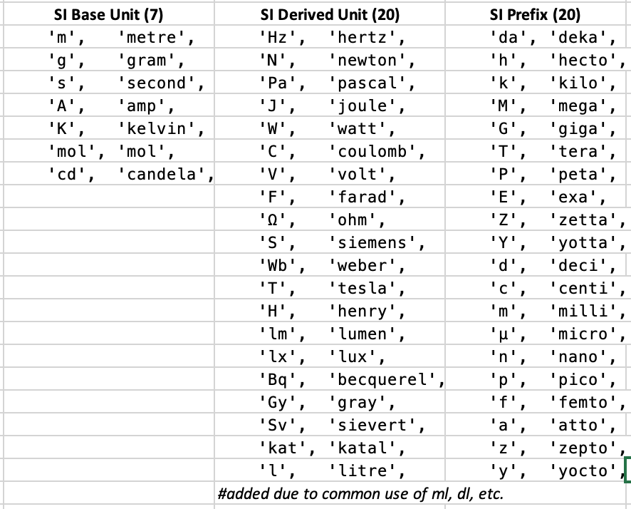

[](https://travis-ci.com/p6steve/raku-Physics-Measure)
# raku-Physics-Measure
A set of SI, Imperial and US Unit objects that are employed by Measure objects having value, units and error(tbd) and act as operands in most calculations. Some prefix and physical constants included where needed. Some use of unicode and operator overload.

# Instructions
zef install --verbose https://github.com/p6steve/raku-Physics-Measure.git

and, conversely, zef uninstall Physics::Measure

# Synopsis - Physics::UnitPostfix
[https://github.com/p6steve/raku-Physics-Measure/bin/synopsis-unitpostfix.raku](https://github.com/p6steve/raku-Physics-Measure/blob/master/bin/synopsis-unitpostfix.raku)

```perl6
#!/usr/bin/env raku
use Physics::Measure;
use Physics::UnitPostfix;

my $l = 1km;			    say ~$l;        #1 km           (Length)
my $t = 1ms;			    say ~$t;        #1 ms           (Time)
my $s = $l/$t;			    say ~$s;        #1000000 m/s    (Speed)
my $f = $l.in: <ft>;    	    say ~$f;        #3280.84 ft     (Length)
my $m = 1kg;			    say ~$m;        #1 kg           (Mass)
my $y ♎️ '5e1 km';                  say ~$y;        #50 km          (Length)
my $x = Volume.new(value => 21.006, units => 'μl'); say "$x"; #21.006 μl (Volume)
```
 
Physics::UnitPostfix takes the SI Base Units (7), SI Derived Units (20) and SI Prefixes (20):
* defines Unit objects for all combinations of Prefixes x [Base|Derived]Unit short names
* declares raku ```<postfix>``` operators for all of these combinations and exports them into your namespace

IMPORTANT:
* you will need to go in and uncomment if you want all compound SI units (~30) xx all Prefixes (~20) - as default these are limited to length(m), time(s), mass(kg) and volume(l) for installation performance reasons...
* you will need to use Physics::UnitPostfix anytime you want compound units to be defined - even if you do not need the postfix variant of operator - e.g. for ```my $x = Length.new(value => 17, units => 'cm'); my $y ♎️ '5e1 km';``` and so on



# Synopsis - Physics::Measure & Physics::Unit
[https://github.com/p6steve/raku-Physics-Measure/bin/synopsis.raku](https://github.com/p6steve/raku-Physics-Measure/blob/master/bin/synopsis.raku)

```perl6
#!/usr/bin/env raku
use Physics::Unit;
use Physics::Measure;

#SYNOPSIS

#Unit objects can be selected or created with GetUnit:
    my Unit   $u  = GetUnit( 'm' );
#Define your own unit named "ff" (named args)
    my $ff = Unit.new( defn => 'furlong / fortnight', names => ['ff'] );

#Measure objects such as Length can be formally constructed:
    my Length $a .=new(value => 1e4, units => $u);		say "$a";		#10000 m

#The libra operator ♎️ is a handy way to construct objects...
    my $b ♎️ '5e1 m';						say "$b";		#50 m
    my $c ♎️ $a;						say "$c";		#10000 m
    my Length $l ♎️ 42;						say "$l";		#42 m
#...and to assign objects a value:
    $a ♎️ 3e1;          								#'30 m'
    $a ♎️ '3 yards';    								#'3 yards'
    $a ♎️ 5;            								#'5 yards'
#...there is an ASCII "texas" variant of <♎️> namely <libra> 

#To see what you have
    say $a.Real;        #50   or use $a in Real context (Real includes Int|Rat|Num etc)
    say $a.Str;         #50 m or use $a in Str context
    say "$a";           #50 m (values are rounded to 0.001 decimals by Str)

#The usual arithmetic operators < + - * / > and () brackets just work
#i.e. units and magnitudes are checked, calculated and errors are calculated automatically    
    $a ♎️ '4.3 m';      #'4.3 m' 
    $b ♎️ -2.3;         #'-2.3 m'
    $c = $a + $b;       #'2 m'
    $c = $a + '42 m';   #'46.3 m'
    $c = $b - $a;       #'-6.6 m'
    $c = '1 m' - $a;    #'-3.3 m' 
#Division like for like produces a Real value such as a Rat
    my Real $r = $a / $b; #'-1.8696'
#Multiply with & Divide by a Real imply a constant factor...
    $c = $b * 30;       #'-69 m'
    
#The Physics::Measure $round-to variable is applied to Str output
    $round-to = 0.01;

#Angles use degrees/minutes/seconds or decimal radians
    my $θ1 ♎️ <45°30′30″>;      #45°30′30″ (using <> to deconfuse quotation marks)
    my $θ2 ♎️ '2.141 radians';  #'2.141 radian'
#NB. The unit name 'rad' is reserved for the unit of radioactive Dose

# Trigonometric functions sin, cos and tan (and arc-x) handle Angles
    my $sine = sin( $θ1 );      #0.7133523847299412
    my $arcsin = asin( $sine, units => '°' ); #45°30′30″
#NB. Provide the units => '°' tag to tell asin you want degrees back

#The Measure of Time has a raku Duration - i.e. the difference between two DateTime Instants:
    my $i1 = DateTime.now;
    my $i2 = DateTime.new( '2020-08-10T14:15:27.26Z' );
    my $i3 = DateTime.new( '2020-08-10T14:15:37.26Z' );
    my Duration $dur = $i3-$i2;

#Here's how to us the libra assignment operator ♎️ for Time...
    my Time $t1 ♎️ '5e1 s';     	#50 s
    my Time $t2 ♎️ $dur;        	#10 s
    my $t3 = $t1 + $t2;         	#60 s
    my Time $t4 ♎️ '2 hours';   	#2 hr
    $dur = $t4.Duration;		#7200

#Unit Conversion uses the .in() method - specify the new units as a String
    my Length $df ♎️ '12.0 feet';
    my $dm = $df.in( 'm' );		#3.658 m
       $dm = $df.in: <m> ;		#alternate form
    my Temperature $deg-c ♎️ '39 ºC';
    my $deg-k = $deg-c.in( 'K' );       #312.15 K
    my $deg-cr = $deg-k.in( 'ºC' );     #39 ºC
#Use arithmetic to get high order or inverse Unit types such as Area, Volume, Frequency, etc.
    my Area	  $x = $a * $a;         #18.49 m^2
    my Speed      $s = $a / $t2;        #0.43 m/s
    my Frequency  $f = 1  / $t2;        #0.1 Hz

#Use powers & roots in a similar way
    my Volume     $v = $a ** 3;         #79.507 m^3
    my Length	  $d = $v ** <1/3>;     #0.43 m

#About 230 built in units are included, for example...
    my $v2 ♎️ '7 yards^3';		#7 yard^3		(Volume)
    my $v3 = $v2.in( 'm3' );		#5.352 m^3		(Volume) 
    my $dsdt = $s / $t1;		#0.009 m/s^2		(Acceleration)
    my $sm ♎️ '70 mph';                	#70 mph			(Speed)
    my $fo ♎️ '27 kg m / s^2';		#27 N			(Force)
    my $en1 ♎️ '26 kg m^2 / s^2';	#26 J			(Energy)
    my $po ♎️ '25 kg m^2 / s^3';	#25 W			(Power)
    my $en2 = $po * $t1;                #1250 J			(Energy)
    say $po.canonical;			#25 m2.s-3.kg   	(SI base units)
    say $po.pretty;			#25 m²⋅s⁻³⋅kg   	(SI recommends)
    say ListBases(); say ListTypes(); say ListUnits();

#Measures can be converted to base type with the .rebase() method
    my $v4 = $v3.rebase;		#5.352 m^3
#Measures can be compared with $a cmp $b
    my $af = $a.in: 'feet';             #4.3 m => 14.108 feet
    say $af cmp $a;                     #Same
#Measures can be tested for equality with Numeric ==,!=
    say $af == $a;                      #True
    say $af != $a;                      #False
#Use string equality eq,ne to distinguish different units with same type  
    say $af eq $a;                      #False
    say $af ne $a;                      #True

#Colloquial terms or unicode superscripts can be used for powers in unitname declarations 
    #square, sq, squared, cubic, cubed
    #x¹ x² x³ x⁴ and x⁻¹ x⁻² x⁻³ x⁻⁴

#EOF
```
